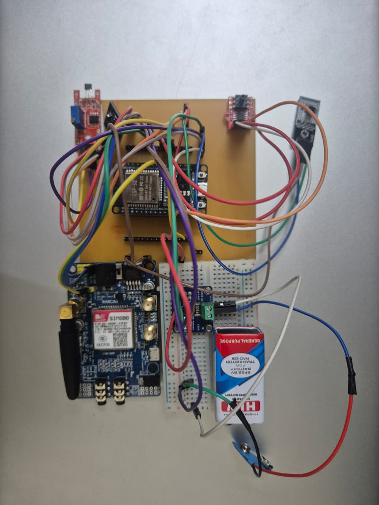
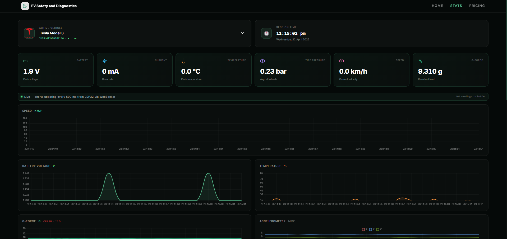
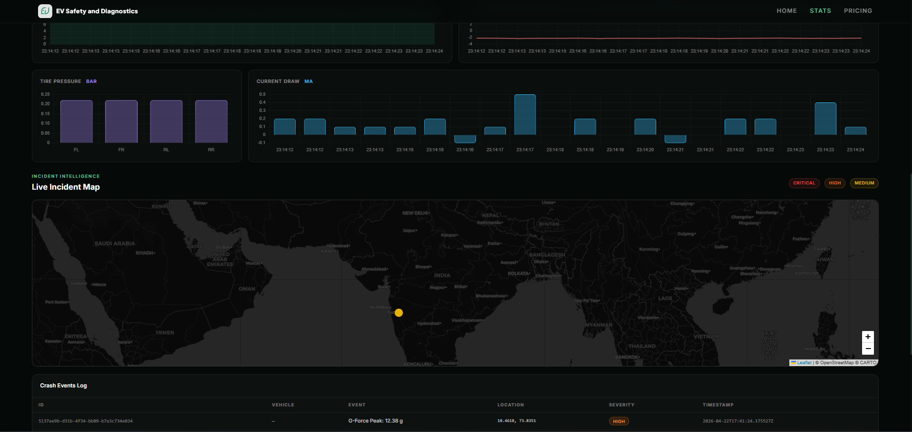
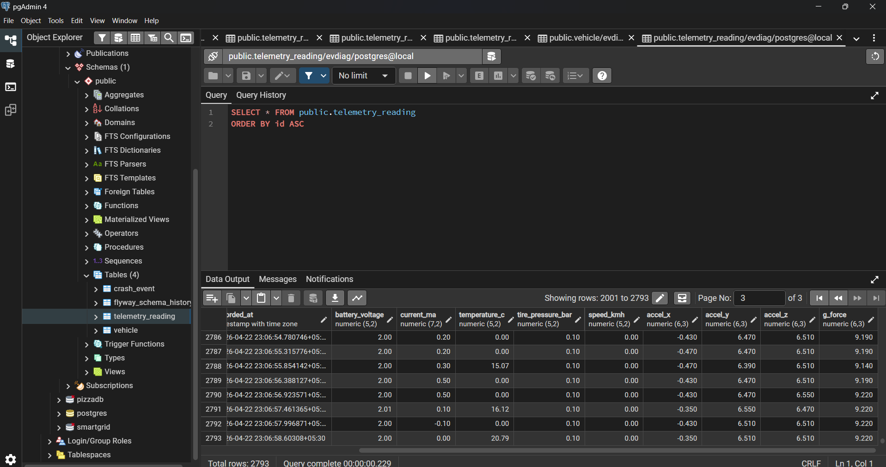

# EV Safety & Diagnostics — Real-Time Vehicle Monitoring System

<div align="center">


**A full-stack IoT platform for real-time electric vehicle telemetry, crash detection, and fleet diagnostics.**

Sensor data flows from an **ESP32 microcontroller** → **MQTT broker** → **Spring Boot backend** → **PostgreSQL** → **live React dashboard** via WebSocket — end-to-end latency under 300 ms.

</div>

---

## Table of Contents

1. [Overview](#overview)
2. [System Architecture](#system-architecture)
3. [Screenshots](#screenshots)
4. [Tech Stack](#tech-stack)
5. [Hardware & Sensors](#hardware--sensors)
6. [Features](#features)
7. [Project Structure](#project-structure)
8. [Prerequisites](#prerequisites)
9. [Getting Started](#getting-started)
10. [Running the Project](#running-the-project)
11. [REST API Reference](#rest-api-reference)
12. [WebSocket Reference](#websocket-reference)
13. [Database Schema](#database-schema)
14. [Simulating the ESP32](#simulating-the-esp32)
15. [Configuration](#configuration)

---

## Overview

This project is an end-to-end IoT safety platform built for electric vehicles. A custom hardware node built around the **ESP32 DevKit** reads six physical sensors every 500 ms and publishes a JSON payload over WiFi using **MQTT**. A **Spring Boot** server consumes the data stream, persists every reading to **PostgreSQL**, performs g-force-based crash detection, and broadcasts live data to all connected browsers via **STOMP WebSocket**. The **React** dashboard renders real-time charts, stat cards, and a geo-tagged crash incident map — all updating without a page refresh.

The system is designed for resilience: if the WebSocket connection drops, the frontend silently falls back to REST polling every 5 seconds with zero data loss.

---

## System Architecture

```
┌──────────────────────────────────────────────────────────────────┐
│                         HARDWARE LAYER                           │
│                                                                  │
│  [INA219] [LM35] [HX710B] [Hall] [ADXL345] [SIM808]            │
│                     │                                            │
│               [ESP32 DevKit]  ──WiFi──▶  MQTT publish           │
│                                          ev/{vin}/telemetry      │
└──────────────────────────────────────────────────────────────────┘
                              │  JSON payload every 500 ms
                              ▼
┌──────────────────────────────────────────────────────────────────┐
│                 MQTT BROKER — Mosquitto  :1883                   │
└──────────────────────────────────────────────────────────────────┘
                              │  Spring Integration subscribes
                              │  wildcard topic: ev/+/telemetry
                              ▼
┌──────────────────────────────────────────────────────────────────┐
│                  BACKEND — Spring Boot  :8080                    │
│                                                                  │
│  MqttSubscriber → MqttMessageParser → TelemetryService          │
│  ① Auto-register vehicle if VIN is new                          │
│  ② Persist TelemetryReading to PostgreSQL                       │
│  ③ gForce > 12.0 m/s² → persist CrashEvent with GPS coords     │
│  ④ Broadcast TelemetryResponse via STOMP WebSocket              │
└──────────────────┬───────────────────────────────────────────────┘
                   │
       ┌───────────┴────────────┐
       ▼                        ▼
┌──────────────────┐   ┌──────────────────────────────────┐
│  PostgreSQL :5432│   │  React Dashboard  :5173           │
│  · vehicle       │   │  · Live stat cards                │
│  · telemetry_    │   │  · Real-time scrolling charts     │
│    reading       │   │  · Geo-tagged crash incident map  │
│  · crash_event   │   │  · WebSocket / REST fallback      │
└──────────────────┘   └──────────────────────────────────┘
```

---

## Screenshots

### Hardware Assembly
> ESP32 DevKit wired to all six sensors: INA219 (battery voltage/current), ADXL345 (accelerometer), Hall Effect (speed), LM35 (temperature), HX710B (tire pressure), and SIM808 GPS/GSM module — assembled on a custom PCB with breadboard.

<p align="center">
  
</p>

---

### Live Telemetry Dashboard
> Real-time stat cards and scrolling charts updating every 500 ms via WebSocket from the ESP32. Displays battery voltage, current draw, pack temperature, tire pressure, speed, and g-force simultaneously.

<p align="center">
  
</p>

---

### Crash Incident Map & Event Log
> Full-world interactive map (Leaflet) with geo-tagged crash pins color-coded by severity — red (critical), orange (high), yellow (medium). The log table below records VIN, peak g-force, GPS coordinates, and timestamp for every event.

<p align="center">
  
</p>

---

### PostgreSQL — Live Telemetry Records
> The `telemetry_reading` table accumulates all sensor readings with full numeric precision. Indexed on `(vehicle_id, recorded_at)` for efficient time-range queries on thousands of rows.

<p align="center">
  
</p>

---

## Tech Stack

| Layer | Technology | Version | Purpose |
|---|---|---|---|
| Microcontroller | ESP32 DevKit | — | WiFi-enabled MCU with I2C / SPI / ADC / UART support |
| IoT Protocol | MQTT (Mosquitto) | — | Lightweight pub/sub designed for constrained IoT devices |
| Backend | Java + Spring Boot | 21 / 3.2.5 | REST API, WebSocket, MQTT ingestion pipeline |
| Messaging | Spring Integration | — | MQTT channel adapter with wildcard topic subscription |
| Build Tool | Maven | 3.9+ | Dependency management, reproducible JAR packaging |
| Database | PostgreSQL | 14+ | ACID-compliant relational DB for time-series telemetry |
| Schema Migrations | Flyway | — | Versioned SQL migrations, auto-applied on startup |
| ORM | Hibernate JPA | — | Entity mapping; `validate` mode prevents accidental schema drift |
| Frontend | React + Vite | 18.3.1 / 5.4.10 | Component-driven SPA with instant hot-reload |
| Styling | TailwindCSS | 3.4.14 | Utility-first responsive design system |
| Charts | Chart.js | 4.4.0 | Animated real-time line, area, and bar charts |
| Maps | Leaflet | 1.9.4 | Open-source interactive maps with custom crash markers |
| WebSocket Client | STOMP.js + SockJS | 7.0.0 | STOMP over WebSocket with automatic reconnection |
| Embedded Firmware | PubSubClient + ArduinoJson | — | MQTT publish and JSON serialization on ESP32 |

---

## Hardware & Sensors

<p align="center">
  
</p>

| Sensor | Measures | Interface | ESP32 GPIO Pins |
|---|---|---|---|
| **INA219** | Battery voltage (V) + current draw (mA) | I2C — addr `0x40` | SDA: GPIO 21 · SCL: GPIO 22 |
| **LM35** | Motor / pack temperature (°C) | Analog ADC | GPIO 34 |
| **HX710B** | Tire pressure (bar) | Digital CLK/DOUT | CLK: GPIO 26 · DOUT: GPIO 27 |
| **Hall Effect** | Vehicle speed via magnetic pulse counting | Digital interrupt | GPIO 25 |
| **ADXL345** | 3-axis acceleration + resultant g-force | I2C — addr `0x53` | SDA: GPIO 21 · SCL: GPIO 22 |
| **SIM808** | GPS coordinates at crash moment | UART2 serial | RX2: GPIO 16 · TX2: GPIO 17 |

**Publish cadence:** every 500 ms under normal operation; immediately on crash (gForce > 12.0 m/s²).

### Sample MQTT Payload
```json
{
  "vehicleId":       "EV-2025-TM3-001",
  "batteryVoltage":  387.5,
  "currentMa":       120.3,
  "temperatureC":    32.1,
  "tirePressureBar": 2.4,
  "speedKmh":        72.0,
  "accelX":          0.10,
  "accelY":          0.02,
  "accelZ":          9.80,
  "gForce":          9.81,
  "latitude":        28.6139,
  "longitude":       77.2090
}
```

---

## Features

- **Real-time telemetry** — six sensor channels update the dashboard at 500 ms intervals via STOMP WebSocket
- **Automatic crash detection** — g-force threshold analysis (> 12.0 m/s²); crash events are persisted with exact GPS coordinates and timestamp
- **Geo-tagged incident map** — Leaflet map with color-coded crash pins (critical / high / medium severity) and a sortable event log table
- **Auto vehicle registration** — a new VIN is registered in the database the moment its first MQTT message arrives; zero manual configuration required
- **Offline resilience** — if the WebSocket drops, the frontend falls back to REST polling every 5 seconds with a status banner; all chart data continues updating
- **Multi-vehicle support** — MQTT wildcard `ev/+/telemetry` and per-VIN WebSocket topics (`/topic/live/{vin}`) support any number of vehicles simultaneously
- **Schema versioning** — Flyway applies three ordered migration files on startup; Hibernate `validate` mode prevents schema drift in production
- **Single-JAR deployment** — the React production build can be embedded in the Spring Boot static folder, serving the full stack from one process on port 8080

---

## Project Structure

```
.
├── ev-safety-backend/                   # Spring Boot application
│   ├── src/main/java/com/evdiag/
│   │   ├── config/
│   │   │   ├── MqttConfig.java          # MQTT connection & Spring Integration adapter
│   │   │   └── WebSocketConfig.java     # STOMP endpoint at /ws
│   │   ├── mqtt/
│   │   │   ├── MqttSubscriber.java      # @ServiceActivator — receives raw MQTT messages
│   │   │   └── MqttMessageParser.java   # Deserializes JSON → TelemetryPayload
│   │   ├── service/
│   │   │   ├── TelemetryService.java    # Core: persist → crash detect → broadcast
│   │   │   └── VehicleService.java      # Vehicle registration & lookup
│   │   ├── controller/
│   │   │   ├── VehicleController.java
│   │   │   ├── TelemetryController.java
│   │   │   └── CrashEventController.java
│   │   ├── repository/                  # Spring Data JPA repositories
│   │   ├── domain/entity/               # Vehicle, TelemetryReading, CrashEvent
│   │   ├── dto/                         # TelemetryPayload, TelemetryResponse
│   │   └── websocket/
│   │       └── TelemetryBroadcaster.java  # SimpMessagingTemplate → /topic/live/{vin}
│   └── src/main/resources/
│       ├── application.yml
│       └── db/migration/                # V1__create_vehicle, V2__telemetry, V3__crash
│
├── ev-safety-frontend/                  # React + Vite SPA
│   └── src/
│       ├── App.jsx                      # Routes: / · /stats · /pricing
│       ├── pages/
│       │   ├── home/HomePage.jsx
│       │   ├── stats/
│       │   │   ├── StatsPage.jsx        # Main dashboard — vehicle select, charts, map
│       │   │   ├── IncidentMap.jsx      # Leaflet map with crash event pins
│       │   │   └── charts/              # LineChart, BarChart, MultiLineChart
│       │   └── pricing/PricingPage.jsx
│       └── services/
│           ├── api.js                   # REST client — getVehicles, getHistory, getCrashes
│           └── websocket.js             # STOMP/SockJS client with auto-reconnect
│
├── ev-safety-esp32/                     # ESP32 Arduino firmware
│   ├── ev-safety-esp32.ino              # setup(), loop(), MQTT publish every 500 ms
│   ├── secrets.h.example                # WiFi & MQTT credentials template
│   └── SETUP_GUIDE.md
│
└── Images/                              # Hardware and dashboard photos
    ├── NPLC_1.jpeg                      # Physical hardware assembly
    ├── NLPC_2.png                       # PostgreSQL telemetry records
    ├── NLPC_3.png                       # Live stats dashboard
    └── NLPC_4.png                       # Crash incident map
```

---

## Prerequisites

| Tool | Version | Notes |
|---|---|---|
| Java JDK | 21+ | Required by Spring Boot 3.2 — `java -version` to verify |
| Maven | 3.9+ | `mvn -v` to verify |
| Node.js | 18+ | Required by Vite and React |
| PostgreSQL | 14+ | Must be running on port 5432 before starting the backend |
| Mosquitto | any | MQTT broker — must allow external connections (see step 3) |
| Arduino IDE | 2.x | Only required for flashing ESP32 firmware |

---

## Getting Started

### 1. Clone the repository

```bash
git clone https://github.com/Emp1500/ev-safety-diagnostics.git
cd ev-safety-diagnostics
```

### 2. Start infrastructure

**With Docker (recommended — one command):**

```bash
docker-compose up -d
```

Starts PostgreSQL on port 5432 and Mosquitto on port 1883 with the correct credentials. Flyway creates all tables automatically on first backend startup.

**Without Docker:**

```sql
-- Create database manually
CREATE USER evuser WITH PASSWORD 'evpass';
CREATE DATABASE evdiag OWNER evuser;
```

Then start Mosquitto with the included config: `mosquitto -c mosquitto.conf`

### 4. Set environment variables

Create a `.env` file at the project root (it is git-ignored):

```env
DB_URL=jdbc:postgresql://localhost:5432/evdiag
DB_USERNAME=evuser
DB_PASSWORD=evpass
MQTT_BROKER_URL=tcp://localhost:1883
```

### 5. Flash the ESP32 firmware (optional — skip to simulate)

```bash
cp ev-safety-esp32/secrets.h.example ev-safety-esp32/secrets.h
```

Edit `secrets.h`:
```cpp
#define WIFI_SSID       "YourNetworkName"
#define WIFI_PASSWORD   "YourPassword"
#define MQTT_BROKER_IP  "192.168.1.105"   // laptop's LAN IP — not "localhost"
#define VEHICLE_VIN     "EV-2025-TM3-001"
```

Open `ev-safety-esp32.ino` in Arduino IDE, install all required libraries, and flash to the board.

---

## Running the Project

Start each service in a separate terminal in this order:

```bash
# Terminal 1 — MQTT Broker
mosquitto -c mosquitto.conf

# Terminal 2 — Backend (Flyway runs migrations automatically on startup)
cd ev-safety-backend
mvn spring-boot:run

# Terminal 3 — Frontend
cd ev-safety-frontend
npm install
npm run dev
```

Open the live dashboard: **http://localhost:5173/stats**

Once the backend is running, these endpoints are also available:

| URL | What It Is |
|---|---|
| http://localhost:8080/swagger-ui.html | Interactive API documentation |
| http://localhost:8080/actuator/health | Health check — `{"status":"UP"}` |
| http://localhost:8080/api-docs | Raw OpenAPI JSON spec |

### Service Port Reference

| Service | Port | Protocol |
|---|---|---|
| React frontend (dev) | 5173 | HTTP |
| Spring Boot backend | 8080 | HTTP + WebSocket |
| PostgreSQL | 5432 | TCP |
| MQTT Broker | 1883 | TCP / MQTT |

### Production build — single URL

```bash
cd ev-safety-frontend && npm run build
cp -r dist/* ../ev-safety-backend/src/main/resources/static/
cd ../ev-safety-backend && mvn spring-boot:run
# Entire application available at http://localhost:8080
```

---

## REST API Reference

**Base URL:** `http://localhost:8080/api/v1`

| Method | Endpoint | Description |
|---|---|---|
| `GET` | `/vehicles` | List all registered vehicles |
| `POST` | `/vehicles` | Register a new vehicle — body: `{"name":"...","vin":"..."}` |
| `GET` | `/telemetry/{vin}/latest` | Most recent telemetry reading for the given VIN |
| `GET` | `/telemetry/{vin}/history` | Paginated history — query params: `from`, `to`, `page`, `size` |
| `GET` | `/crashes/{vin}` | All crash events for the given VIN, newest first |

> All endpoints include `@CrossOrigin(origins = "*")` for cross-origin access during development.

---

## WebSocket Reference

| Property | Value |
|---|---|
| Connection URL | `ws://localhost:8080/ws` (via SockJS transport) |
| Protocol | STOMP over SockJS |
| Subscribe topic | `/topic/live/{vin}` |
| Message format | `TelemetryResponse` JSON — same field structure as REST responses |
| Trigger | Fires on every MQTT message processed by the backend |
| Offline fallback | REST polling every 5 seconds if WebSocket disconnects |

---

## Database Schema

```
vehicle
  id            UUID          PRIMARY KEY (auto-generated)
  name          VARCHAR
  vin           VARCHAR       UNIQUE — used in MQTT topics and all API paths
  registered_at TIMESTAMP

telemetry_reading
  id                BIGSERIAL   PRIMARY KEY
  vehicle_id        UUID        REFERENCES vehicle(id)
  recorded_at       TIMESTAMP
  battery_voltage   NUMERIC     Volts
  current_ma        NUMERIC     Milliamps
  temperature_c     NUMERIC     Celsius
  tire_pressure_bar NUMERIC     Bar
  speed_kmh         NUMERIC     km/h
  accel_x           NUMERIC     m/s²
  accel_y           NUMERIC     m/s²
  accel_z           NUMERIC     m/s²
  g_force           NUMERIC     Crash threshold > 12.0 m/s²

crash_event
  id           UUID        PRIMARY KEY
  vehicle_id   UUID        REFERENCES vehicle(id)
  latitude     NUMERIC     GPS at moment of impact
  longitude    NUMERIC     GPS at moment of impact
  g_force_peak NUMERIC     Peak g-force recorded
  occurred_at  TIMESTAMP
```

Schema is fully version-controlled via three Flyway migration files (`V1`, `V2`, `V3`). Hibernate is set to `validate` mode — it verifies the schema matches entities on startup but never alters it.

---

## Simulating the ESP32

The entire pipeline can be tested without physical hardware using `mosquitto_pub`.

### Send a telemetry reading

**Linux / macOS / WSL:**
```bash
mosquitto_pub -h localhost -p 1883 -t "ev/EV-2025-TM3-001/telemetry" -m \
  '{"vehicleId":"EV-2025-TM3-001","batteryVoltage":387.5,"currentMa":120.3,"temperatureC":32.1,"tirePressureBar":2.4,"speedKmh":72.0,"accelX":0.1,"accelY":0.02,"accelZ":9.8,"gForce":9.81,"latitude":28.6139,"longitude":77.2090}'
```

**Windows PowerShell:**
```powershell
@'
{"vehicleId":"EV-2025-TM3-001","batteryVoltage":387.5,"currentMa":120.3,"temperatureC":32.1,"tirePressureBar":2.4,"speedKmh":72.0,"accelX":0.1,"accelY":0.02,"accelZ":9.8,"gForce":9.81,"latitude":28.6139,"longitude":77.2090}
'@ | Out-File -FilePath "$env:TEMP\payload.json" -Encoding UTF8 -NoNewline
mosquitto_pub -h localhost -p 1883 -t "ev/EV-2025-TM3-001/telemetry" -f "$env:TEMP\payload.json"
```

### Simulate a crash event (gForce > 12.0)

```bash
mosquitto_pub -h localhost -p 1883 -t "ev/EV-2025-TM3-001/telemetry" -m \
  '{"vehicleId":"EV-2025-TM3-001","batteryVoltage":380.0,"currentMa":200.0,"temperatureC":45.0,"tirePressureBar":1.8,"speedKmh":95.0,"accelX":8.5,"accelY":9.1,"accelZ":4.2,"gForce":13.5,"latitude":19.0760,"longitude":72.8777}'
```

A crash pin appears on the incident map immediately.

### Continuous stream at 500 ms — mimics live ESP32 publish rate

```bash
while true; do
  SPEED=$(awk 'BEGIN{printf "%.1f", 40 + rand() * 80}')
  GFORCE=$(awk 'BEGIN{printf "%.2f", 9.5 + rand() * 2}')
  mosquitto_pub -h localhost -p 1883 -t "ev/EV-2025-TM3-001/telemetry" -m \
    "{\"vehicleId\":\"EV-2025-TM3-001\",\"batteryVoltage\":387.5,\"currentMa\":120.3,\"temperatureC\":32.1,\"tirePressureBar\":2.4,\"speedKmh\":$SPEED,\"accelX\":0.1,\"accelY\":0.02,\"accelZ\":9.8,\"gForce\":$GFORCE,\"latitude\":28.6139,\"longitude\":77.2090}"
  sleep 0.5
done
```

---

## Configuration

### Backend — `application.yml`

All sensitive values are read from environment variables with local defaults:

```yaml
spring:
  datasource:
    url: ${DB_URL:jdbc:postgresql://localhost:5432/evdiag}
    username: ${DB_USERNAME:evuser}
    password: ${DB_PASSWORD:evpass}
  mqtt:
    broker-url: ${MQTT_BROKER_URL:tcp://localhost:1883}
```

### Crash Detection Threshold

The g-force threshold is defined in two places — both must stay in sync:

- **Backend:** `TelemetryService.java` → `CRASH_G_FORCE_THRESHOLD = 12.0`
- **ESP32:** `secrets.h` → `#define CRASH_G_THRESHOLD 12.0f`

---

<div align="center">

Built for **NLPC Competition 2026**

</div>
